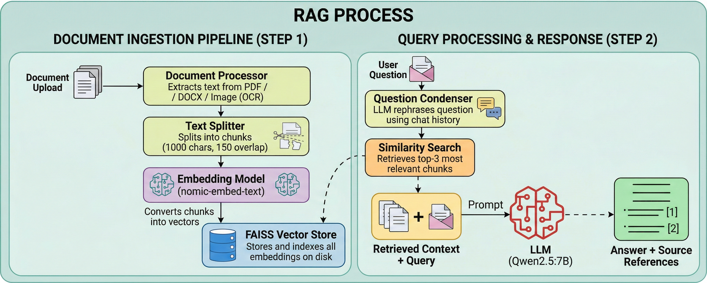

<div align="center">

# RAG Assistant — Document Q&A System

**Hệ thống hỏi đáp tài liệu theo kiến trúc RAG** cho môi trường học tập và triển khai nội bộ, hỗ trợ upload nhiều định dạng, OCR, memory hội thoại, benchmark retrieval và chunk strategy.

<br/>

[](https://www.python.org/)
[](https://www.djangoproject.com/)
[](https://reactjs.org/)
[](https://www.typescriptlang.org/)
[](https://vitejs.dev/)
[](https://ollama.ai/)
[](https://github.com/facebookresearch/faiss)

</div>

---

## Giới thiệu dự án

RAG Assistant là dự án full-stack tách lớp rõ ràng:
- Backend Django REST xử lý ingestion, retrieval, generation.
- Frontend React + TypeScript cung cấp giao diện chat, upload, filter và quản trị tài liệu.

Hệ thống phù hợp cho:
- Hỏi đáp theo tài liệu nội bộ.
- Kiểm thử chất lượng retrieval theo nhiều cấu hình.
- Demo luồng RAG có memory hội thoại và self-check confidence.

---

<div align="center">



</div>

---

## Tính năng nổi bật

### Dành cho người dùng

| Tính năng | Mô tả |
|---|---|
| Upload tài liệu | Upload 1 hoặc nhiều file qua field `files` hoặc `file` |
| Hỏi đáp theo ngữ cảnh | Chat dựa trên context đã index từ tài liệu upload |
| Conversational memory | Gửi `session_id` + `history` để follow-up question ổn định hơn |
| Metadata filtering | Lọc retrieval theo `filenames` và `file_types` |
| Quản lý tài liệu đã nạp | Xóa tài liệu theo `filename` qua API riêng |

### Dành cho kỹ thuật / vận hành

| Tính năng | Mô tả |
|---|---|
| System status | Trả về model, vector DB, số lượng tài liệu, danh sách file đã index |
| Clear vector store | Reset toàn bộ FAISS index nhanh qua endpoint `DELETE /api/clear/` |
| Chunk strategy benchmark | Đánh giá nhiều tổ hợp `chunk_size/chunk_overlap` theo `evaluation_set` |
| Retrieval mode benchmark | So sánh `vector`, `hybrid`, `hybrid_rerank` theo accuracy + latency |
| Session memory reset | Xóa memory theo `session_id` cho từng cuộc hội thoại |

---

## So sánh retrieval mode

| Mode | Cơ chế | Điểm mạnh | Trade-off |
|---|---|---|---|
| `vector` | Similarity thuần embedding | Nhanh, đơn giản | Có thể hụt keyword đặc thù |
| `hybrid` | Vector + keyword | Cân bằng tốt precision/recall | Phức tạp hơn vector thuần |
| `hybrid_rerank` | Hybrid + rerank | Kết quả top đầu chất lượng hơn | Độ trễ cao hơn |

---

## Kiến trúc hệ thống

```text
PTPM_MNM/
├── backend/                        # Django + DRF API
│   ├── api/                        # URL routing + API views
│   ├── src/
│   │   ├── ingestion/              # OCR + document processing
│   │   └── rag/                    # Retrieval, indexing, memory, evaluation
│   ├── rag_project/                # Django settings
│   ├── vector_db/                  # FAISS index + source_documents.json
│   ├── requirements.txt
│   └── manage.py
├── frontend/                       # React + TypeScript + Vite
│   ├── src/components/
│   ├── src/services/api.ts         # Typed API contracts
│   └── package.json
└── README.md
```

---

## API

Base URL: `http://localhost:8000/api`

| Endpoint | Method | Mô tả | Payload chính |
|---|---|---|---|
| `/upload/` | POST | Upload + index tài liệu | `file`/`files`, `chunk_size`, `chunk_overlap` |
| `/chat/` | POST | Hỏi đáp theo RAG | `question`, `history`, `session_id`, `retrieval_mode`, `filenames`, `file_types`, `use_reranker`, `use_self_rag` |
| `/chat/memory/clear/` | POST | Reset memory theo session | `session_id` |
| `/status/` | GET | Kiểm tra trạng thái runtime | None |
| `/clear/` | DELETE | Xóa toàn bộ vector store | None |
| `/documents/delete/` | DELETE | Xóa tài liệu theo tên file | `filename` |
| `/chunk-strategy/evaluate/` | POST | Benchmark chunk strategy | `evaluation_set`, `chunk_sizes`, `chunk_overlaps`, `top_k` |
| `/retrieval/benchmark/` | POST | Benchmark retrieval mode | `evaluation_set`, `retrieval_modes`, `top_k`, `filenames`, `file_types` |

---

## Cấu hình môi trường
Tạo file `.env` trong thư mục `backend/` theo `.env.example`.
```bash
SECRET_KEY=your-secret-key-here-change-in-production    #Django secret key
DEBUG=True                                              #Bật/tắt debug

# Ollama Configuration
OLLAMA_BASE_URL=http://localhost:11434                 #URL Ollama server
OLLAMA_LLM=deepseek-r1:7b                              #LLM dùng để generate
EMBEDDING_MODEL=nomic-embed-text                       #Model embedding  
CHUNK_SIZE=1000                                        #Chunk size mặc định
CHUNK_OVERLAP=150                                      #Chunk overlap mặc định
VECTOR_DB_PATH=./vector_db                             #Nơi lưu FAISS index

# Windows only : TESSERACT_CMD=C:\\Program Files\\Tesseract-OCR\\tesseract.exe
TESSERACT_CMD=YOUR_TESSERACT_PATH_HERE                 #Path Tesseract (nếu cần chỉ định)
```

> Lưu ý dev: `ALLOWED_HOSTS=['*']` và `CORS_ALLOW_ALL_ORIGINS=True` đang mở để tiện local development.

---

## Hướng dẫn cài đặt

### Yêu cầu hệ thống

| Thành phần | Yêu cầu |
|---|---|
| Python | `>= 3.10` |
| Node.js | `>= 18` |
| Tesseract OCR | Có cài `tesseract-ocr`, `tesseract-ocr-vie`, `tesseract-ocr-eng` |
| Ollama | Đang chạy local + có model cần thiết |

### 1) Clone repository

```bash
git clone https://github.com/NguyenAn-1703/PTPM_MNM.git
cd PTPM_MNM
```

### 2) Cài và chạy backend

```bash
cd backend
python3 -m venv venv
source venv/bin/activate
pip install --upgrade pip
pip install -r requirements.txt
python3 manage.py migrate
python3 manage.py runserver
```

### 3) Cài và chạy frontend

```bash
cd frontend
npm install
npm run dev
```

Ứng dụng chạy tại:
- Frontend: `http://localhost:5173`
- Backend API: `http://localhost:8000/api`

---

## Bảng lệnh nhanh

### Backend

| Mục tiêu | Lệnh |
|---|---|
| Chạy server | `python3 manage.py runserver` |
| Kiểm tra cấu hình Django | `python3 manage.py check` |
| Test OCR | `python3 test_ocr.py` |
| Benchmark chunk bằng script | `python3 test_chunk_strategy.py --evaluation-file evaluation_set.json` |

### Frontend

| Mục tiêu | Lệnh |
|---|---|
| Chạy dev | `npm run dev` |
| Lint | `npm run lint` |
| Build | `npm run build` |
| Preview | `npm run preview` |

---

<div align="center">

 Nếu dự án này hữu ích, hãy để lại một star. ⭐

</div>
